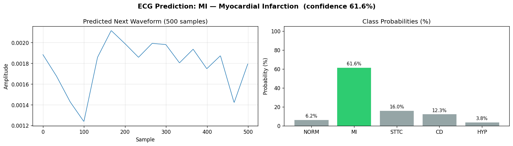

# CardioScan ECG Analysis

CardioScan is a deep learning system that reads an ECG image and does two things at once:

1. **Classifies** the ECG into one of five diagnostic superclasses (Normal, Myocardial Infarction, ST/T-Wave Change, Conduction Disturbance, Hypertrophy).
2. **Predicts the next 500 samples** of the ECG waveform.

It ships with a Flask web app that shows the prediction together with **explainability visuals** (Grad-CAM heatmap and channel attribution), so you can see *why* the model made its call.

> **Disclaimer:** This project is for research and education only. It is not a medical device and must not be used to diagnose or treat any condition. Always consult a qualified clinician.

---

## Features

- Hybrid architecture combining **ViT-B/16**, **EfficientNet-B0**, a **bidirectional ConvLSTM**, a **Transformer encoder** and a **TCN** decoder
- Multi-task output: 5-class diagnosis + 500-sample waveform forecast
- Two-phase training (frozen backbones, then fine-tuning) with early stopping
- Full evaluation script: accuracy, F1, precision, recall, ROC-AUC, confusion matrix, RMSE / MAE / R²
- Command-line inference for single images, WFDB records or whole folders
- Web app with **Grad-CAM** and **Integrated Gradients** explanations
- Automatic CPU / GPU configuration

## Diagnostic Classes

| Code | Meaning |
|------|---------|
| NORM | Normal ECG |
| MI   | Myocardial Infarction |
| STTC | ST/T-Wave Change |
| CD   | Conduction Disturbance |
| HYP  | Hypertrophy |

## Dataset

This project uses the **[PTB-XL](https://physionet.org/content/ptb-xl/)** database from PhysioNet, a large public collection of clinical 12-lead ECG records with diagnostic annotations. Records are mapped to the five superclasses above using `scp_statements.csv`.

The dataset is **not included** in this repository. Download it and place `ptbxl_database.csv`, `scp_statements.csv` and the `records500/` folder in the project root.

## Model Architecture

```
ECG image (3 x 224 x 224)
        |
  Dual encoder:  ViT-B/16  +  EfficientNet-B0   (ImageNet pretrained, fused to 512-d)
        |
  Expand to a 16-step sequence
        |
  Bidirectional ConvLSTM
        |
  Transformer encoder (3 layers, 8 heads)
        |
   +----+-----------------------+
   |                            |
 TCN decoder                 MLP classifier
 (3 dilated blocks)          (5 classes)
   |                            |
 500-sample waveform         Diagnosis
```

## Project Structure

```
cardioscan-ecg/
├── app.py                    # Flask web app with Grad-CAM + Integrated Gradients
├── config_OPTIMIZED.py       # Paths, hyperparameters, CPU/GPU settings
├── model_OPTIMIZED.py        # UltimateECGHybrid model definition
├── pre_render_OPTIMIZED.py   # Converts ECG signals to PNG images
├── train_OPTIMIZED.py        # Two-phase training pipeline
├── evaluate.py               # Test-set metrics, confusion matrix, JSON report
├── predict.py                # Command-line inference
├── trail-1.ipynb             # Experiments notebook
├── training_results.json     # Loss history and test loss from training
├── requirements.txt          # Python dependencies
└── predictions/              # Example prediction outputs
```

Folders created at runtime and excluded from Git: `ecg_images/`, `models/`, `checkpoints/`, `logs/`, `uploads/`, `evaluation/`.

## Getting Started

### Prerequisites

- Python 3.9 or higher
- A GPU is recommended. Training also works on CPU, but it is much slower.

### Installation

```bash
git clone https://github.com/Tamiksha-porcupine/cardioscan-ecg.git
cd cardioscan-ecg
pip install -r requirements.txt
```

### Prepare the data

Download PTB-XL (see [Dataset](#dataset)) so your folder looks like this:

```
cardioscan-ecg/
├── ptbxl_database.csv
├── scp_statements.csv
├── records500/
└── ...
```

## Usage

Run the steps in this order.

**1. Pre-render ECG images**

```bash
python pre_render_OPTIMIZED.py
```

Renders the first 1000 samples of Lead I for every record into `ecg_images/`.

**2. Train the model**

```bash
python train_OPTIMIZED.py
```

Saves the best weights to `models/ecg_best.pth`, the loss curve to `models/loss_curves.png`, and metrics to `training_results.json`.

> On CPU, the config automatically trains on a 500-record subset for 6 epochs so it finishes in reasonable time. On GPU it uses all records for 10 epochs.

**3. Evaluate**

```bash
python evaluate.py
```

Writes `evaluation/evaluation_report.json`, `confusion_matrix.png` and `f1_per_class.png`.

**4. Predict from the command line**

```bash
# A pre-rendered ECG image
python predict.py --image path/to/ecg.png

# A raw WFDB record (give the path without the .hea / .dat extension)
python predict.py --record path/to/record

# Every PNG in a folder
python predict.py --batch path/to/folder/
```

Results are saved to `predictions/` as `prediction_report.json` and `prediction_plot.png`. Use `--weights` to point at a different checkpoint, or `--no-report` to skip saving.

**5. Launch the web app**

```bash
python app.py
```

Open **http://localhost:5000**, upload an ECG image, and you get the diagnosis, confidence, class probabilities, predicted waveform and the explainability charts.

## Training Setup

| Setting | Value |
|---------|-------|
| Data split | 70% train / 15% validation / 15% test |
| Loss | 0.7 x MSE (waveform) + 0.3 x Cross-Entropy (class) |
| Optimizer | AdamW, weight decay 1e-4 |
| Phase 1 (epochs 1-3) | Backbones frozen, learning rate 1e-4 |
| Phase 2 (epochs 4-10) | Backbones unfrozen, learning rate 1e-6 |
| Early stopping | Patience of 4 epochs |
| Input | 224 x 224 RGB image of ECG Lead I |

## Results

Loss values from `training_results.json` (combined waveform + classification loss, 10 epochs on GPU):

| Metric | Value |
|--------|-------|
| Final training loss | 0.3021 |
| Best validation loss | 0.3248 |
| Test loss | 0.3229 |


Validation loss flattens after epoch 6 and ticks up in the last epoch while training loss keeps falling, so the model starts to overfit near the end. The checkpoint with the lowest validation loss is the one saved.

Classification metrics on the test set (run `python evaluate.py` to reproduce):

| Metric | Value |
|--------|-------|
| Accuracy | [xx%] |
| F1 (macro) | [0.xx] |
| ROC-AUC (macro, one-vs-rest) | [0.xx] |

Per-class precision, recall and F1 are in `evaluation/evaluation_report.json`.

### Example prediction



## Explainability

The web app includes two explanation methods:

- **Grad-CAM:** a heatmap over the ECG image showing which regions influenced the prediction most.
- **Integrated Gradients:** the relative contribution of each image colour channel to the predicted class.

## Limitations

- The model sees a rendered image of **Lead I only** (the first 1000 samples), not all 12 leads.
- Each record is assigned a single label (the first matching diagnostic superclass), although PTB-XL records can carry several.
- Trained and tested on one dataset (PTB-XL); performance on other devices, hospitals or populations is untested.
- Trained weights (`*.pth`) are not stored in the repository. Train the model yourself to generate `models/ecg_best.pth`.

## Tech Stack

Python, PyTorch, torchvision, Flask, WFDB, scikit-learn, pandas, NumPy, Matplotlib, Seaborn

## Future Improvements

- Use all 12 leads instead of Lead I only
- Multi-label classification
- External validation on additional ECG datasets
- Publish pretrained weights

## Acknowledgements

- [PTB-XL ECG database](https://physionet.org/content/ptb-xl/) (PhysioNet)
- Pretrained ViT-B/16 and EfficientNet-B0 from torchvision

## Author
Tamiksha Sharma

